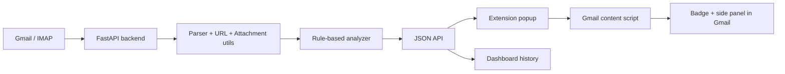

# Gmail Threat Analyzer

[](https://www.python.org/)
[](https://fastapi.tiangolo.com/)
[](https://developer.chrome.com/docs/extensions/)

**Languages:** [English](#english) | [Tiếng Việt](#tiếng-việt)

## English

Gmail Threat Analyzer is a phishing-risk analysis project for Gmail. It combines a FastAPI backend with a Chrome Extension Manifest V3 client. The backend reads Gmail messages through IMAP, extracts email content, URLs, attachments and authentication headers, then runs a rule-based analyzer that returns a risk score, verdict and supporting evidence. The extension provides scan controls, local scan history, a dashboard and in-Gmail warning badges.

### Key Features

- Scan Gmail messages through IMAP with a Gmail App Password.
- Analyze subject, sender, body, URLs, attachments, SPF/DKIM/DMARC results and social-engineering signals.
- Return a risk score, verdict, triggered rules and evidence.
- Chrome extension with popup scan controls, configurable backend URL, scan dashboard and Gmail content-script badges.
- Exact Gmail message/thread ID binding to reduce mismatches between scan results and Gmail UI rows.
- Optional local login persistence is disabled by default and ignored by Git when enabled.

### Architecture



### Tech Stack

- Python 3.10+
- FastAPI, Uvicorn, Pydantic
- Pandas
- Cryptography
- Requests, tldextract
- Chrome Extension Manifest V3

### Project Structure

```text
gmail-threat-analyzer/
├── backend/
│   ├── api/                  # FastAPI routes
│   ├── core/                 # IMAP, parser, analyzer, URL, auth and feed helpers
│   ├── brand_allowlist.csv   # Brand/domain allowlist used by the analyzer
│   ├── config.py             # Runtime paths and mailbox map
│   ├── constants.py          # Rule constants and reference data
│   ├── iao.py                # FastAPI app entrypoint
│   └── models.py             # Internal dataclass models
├── extension/
│   ├── manifest.json
│   ├── popup.html / popup.js
│   ├── options.html / options.js
│   ├── dashboard.html / dashboard.js
│   ├── content.js
│   └── service_worker.js
├── requirements.txt
├── SECURITY.md
└── README.md
```

### Run the Backend

Windows PowerShell:

```powershell
python -m venv .venv
.\.venv\Scripts\Activate.ps1
pip install -r requirements.txt
uvicorn iao:app --app-dir backend --reload --host 127.0.0.1 --port 8000
```

macOS / Linux:

```bash
python -m venv .venv
source .venv/bin/activate
pip install -r requirements.txt
uvicorn iao:app --app-dir backend --reload --host 127.0.0.1 --port 8000
```

Health checks:

```bash
curl http://127.0.0.1:8000/health
curl http://127.0.0.1:8000/api/health
```

Swagger UI:

```text
http://127.0.0.1:8000/docs
```

### Install the Chrome Extension

1. Open Chrome and go to `chrome://extensions`.
2. Enable `Developer mode`.
3. Click `Load unpacked`.
4. Select the project `extension/` folder.
5. Open the extension Options page and keep the backend URL as `http://127.0.0.1:8000`.
6. Open Gmail, sign in, then use the popup to scan messages.

### Main API Endpoints

| Method | Endpoint | Description |
| --- | --- | --- |
| `GET` | `/health` | Root backend health check |
| `GET` | `/api/health` | API router health check |
| `GET` | `/api/rules` | List analyzer rules |
| `GET` | `/api/brand-allowlist` | List trusted brand/domain entries |
| `POST` | `/api/analyze-email` | Analyze a single email payload |
| `POST` | `/api/fetch-imap-emails` | Fetch emails from IMAP |
| `POST` | `/api/scan-imap-batch` | Fetch and analyze a batch of emails |
| `POST` | `/api/scan-imap-targets` | Scan by Gmail message/thread IDs |
| `GET` | `/api/saved-login` | Read locally saved login data |
| `DELETE` | `/api/saved-login` | Delete locally saved login data |

Example batch scan:

```bash
curl -X POST http://127.0.0.1:8000/api/scan-imap-batch \
  -H "Content-Type: application/json" \
  -d '{
    "email": "your-email@gmail.com",
    "app_password": "your-gmail-app-password",
    "mailbox_label": "Hộp thư đến (INBOX)",
    "limit": 10,
    "enable_online_checks": true,
    "remember_login": false
  }'
```

### Security Notes

- Do not commit Gmail App Passwords, `.env` files, local databases or key files.
- Runtime files such as `backend/saved_login.db` and `backend/saved_login.key` are ignored by Git.
- The extension defaults to `remember_login: false`; enable it only when needed on a trusted personal machine.
- Use a dedicated Gmail App Password for demos and revoke it after shared-machine usage.
- This project is intended for learning, demos and rule-based detection research. It is not production security software without additional hardening and review.

## Tiếng Việt

Gmail Threat Analyzer là dự án phân tích rủi ro email phishing cho Gmail. Dự án kết hợp backend FastAPI với Chrome Extension Manifest V3. Backend đọc email Gmail qua IMAP, trích xuất nội dung, URL, attachment, header xác thực và chạy rule-based analyzer để trả về điểm rủi ro, kết luận và bằng chứng. Extension cung cấp popup scan, lịch sử phân tích cục bộ, dashboard và badge cảnh báo trực tiếp trong Gmail.

### Tính Năng Chính

- Quét email Gmail qua IMAP bằng Gmail App Password.
- Phân tích subject, sender, body, URL, attachment, SPF/DKIM/DMARC và các dấu hiệu social engineering.
- Trả về điểm rủi ro, trạng thái, danh sách rule kích hoạt và evidence.
- Chrome Extension có popup scan, cấu hình backend URL, dashboard lịch sử và badge cảnh báo trên Gmail.
- Hỗ trợ exact binding bằng Gmail message/thread ID để giảm gán nhầm kết quả scan với dòng mail trong Gmail.
- Lưu login local là tùy chọn, mặc định tắt và được Git ignore khi bật.

### Kiến Trúc


### Công Nghệ

- Python 3.10+
- FastAPI, Uvicorn, Pydantic
- Pandas
- Cryptography
- Requests, tldextract
- Chrome Extension Manifest V3

### Cấu Trúc Thư Mục

```text
gmail-threat-analyzer/
├── backend/
│   ├── api/                  # API routes FastAPI
│   ├── core/                 # IMAP, parser, analyzer, URL, auth, feed helpers
│   ├── brand_allowlist.csv   # Allowlist brand/domain dùng cho analyzer
│   ├── config.py             # Đường dẫn runtime và mailbox map
│   ├── constants.py          # Rule constants và dữ liệu tham chiếu
│   ├── iao.py                # FastAPI app entrypoint
│   └── models.py             # Dataclass model nội bộ
├── extension/
│   ├── manifest.json
│   ├── popup.html / popup.js
│   ├── options.html / options.js
│   ├── dashboard.html / dashboard.js
│   ├── content.js
│   └── service_worker.js
├── requirements.txt
├── SECURITY.md
└── README.md
```

### Chạy Backend

Windows PowerShell:

```powershell
python -m venv .venv
.\.venv\Scripts\Activate.ps1
pip install -r requirements.txt
uvicorn iao:app --app-dir backend --reload --host 127.0.0.1 --port 8000
```

macOS / Linux:

```bash
python -m venv .venv
source .venv/bin/activate
pip install -r requirements.txt
uvicorn iao:app --app-dir backend --reload --host 127.0.0.1 --port 8000
```

Kiểm tra backend:

```bash
curl http://127.0.0.1:8000/health
curl http://127.0.0.1:8000/api/health
```

Swagger UI:

```text
http://127.0.0.1:8000/docs
```

### Cài Chrome Extension

1. Mở Chrome và vào `chrome://extensions`.
2. Bật `Developer mode`.
3. Chọn `Load unpacked`.
4. Chọn thư mục `extension/` của dự án.
5. Mở Options của extension và giữ backend URL là `http://127.0.0.1:8000`.
6. Mở Gmail, đăng nhập, sau đó dùng popup để scan email.

### API Chính

| Method | Endpoint | Mô tả |
| --- | --- | --- |
| `GET` | `/health` | Kiểm tra backend root |
| `GET` | `/api/health` | Kiểm tra API router |
| `GET` | `/api/rules` | Xem rule analyzer |
| `GET` | `/api/brand-allowlist` | Xem allowlist brand/domain |
| `POST` | `/api/analyze-email` | Phân tích một email đã có payload |
| `POST` | `/api/fetch-imap-emails` | Lấy email từ IMAP |
| `POST` | `/api/scan-imap-batch` | Lấy và phân tích batch email |
| `POST` | `/api/scan-imap-targets` | Scan theo Gmail message/thread ID |
| `GET` | `/api/saved-login` | Đọc login local đã lưu |
| `DELETE` | `/api/saved-login` | Xóa login local đã lưu |

Ví dụ scan batch:

```bash
curl -X POST http://127.0.0.1:8000/api/scan-imap-batch \
  -H "Content-Type: application/json" \
  -d '{
    "email": "your-email@gmail.com",
    "app_password": "your-gmail-app-password",
    "mailbox_label": "Hộp thư đến (INBOX)",
    "limit": 10,
    "enable_online_checks": true,
    "remember_login": false
  }'
```

### Lưu Ý Bảo Mật

- Không commit Gmail App Password, `.env`, database local hoặc file khóa.
- Các file runtime như `backend/saved_login.db` và `backend/saved_login.key` đã được Git ignore.
- Extension mặc định gửi `remember_login: false`; chỉ bật nhớ login khi thật sự cần trên máy cá nhân đáng tin cậy.
- Nên dùng Gmail App Password riêng cho demo và revoke sau khi dùng trên máy chung.
- Repo này phù hợp cho học tập, demo và nghiên cứu rule-based detection. Không dùng như công cụ bảo mật sản xuất khi chưa harden và review thêm.

### Dọn Repo Trước Khi Push

```bash
git status --ignored --short
git ls-files --others --exclude-standard
git add .
git commit -m "Prepare phishing mail scanner project"
```

Nếu dùng GitHub CLI:

```bash
gh repo create gmail-threat-analyzer --public --source=. --remote=origin --push
```
