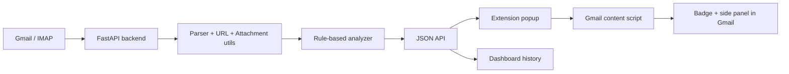

# Based Learning Phishing Mail

[](https://www.python.org/)
[](https://fastapi.tiangolo.com/)
[](https://developer.chrome.com/docs/extensions/)

Based Learning Phishing Mail là một dự án phát hiện email phishing gồm backend FastAPI và Chrome Extension Manifest V3. Backend đọc email Gmail qua IMAP, trích xuất nội dung, URL, attachment, header xác thực và chạy rule-based analyzer để trả về điểm rủi ro cùng bằng chứng. Extension giúp quét email, lưu lịch sử phân tích cục bộ và gắn cảnh báo trực tiếp trên Gmail.

## Tính năng chính

- Quét email Gmail qua IMAP bằng Gmail App Password.
- Phân tích subject, sender, body, URL, attachment, SPF/DKIM/DMARC và các dấu hiệu social engineering.
- Chấm điểm rủi ro, phân loại trạng thái và trả về danh sách rule đã kích hoạt.
- Chrome Extension có popup scan, options cấu hình backend, dashboard lịch sử và content script gắn badge trên Gmail.
- Hỗ trợ exact binding bằng Gmail message/thread id để tránh gán nhầm kết quả scan.
- Lưu login tùy chọn ở máy local bằng database/key bị ignore khỏi Git.

## Kiến trúc



## Công nghệ

- Python 3.10+
- FastAPI, Uvicorn, Pydantic
- Pandas
- Cryptography
- Requests, tldextract
- Chrome Extension Manifest V3

## Cấu trúc thư mục

```text
based-learning/
├── backend/
│   ├── api/                  # API routes FastAPI
│   ├── core/                 # IMAP, parser, analyzer, URL, auth, feed helpers
│   ├── brand_allowlist.csv   # Allowlist brand/domain dùng cho analyzer
│   ├── config.py             # Đường dẫn runtime và mailbox map
│   ├── constants.py          # Rule constants và dữ liệu tham chiếu
│   ├── iao.py                # FastAPI app entrypoint
│   └── models.py             # Dataclass model nội bộ
├── extension/
│   ├── manifest.json
│   ├── popup.html / popup.js
│   ├── options.html / options.js
│   ├── dashboard.html / dashboard.js
│   ├── content.js
│   └── service_worker.js
├── requirements.txt
├── SECURITY.md
└── README.md
```

## Chạy backend

### Windows PowerShell

```powershell
python -m venv .venv
.\.venv\Scripts\Activate.ps1
pip install -r requirements.txt
uvicorn iao:app --app-dir backend --reload --host 127.0.0.1 --port 8000
```

### macOS / Linux

```bash
python -m venv .venv
source .venv/bin/activate
pip install -r requirements.txt
uvicorn iao:app --app-dir backend --reload --host 127.0.0.1 --port 8000
```

Kiểm tra backend:

```bash
curl http://127.0.0.1:8000/health
curl http://127.0.0.1:8000/api/health
```

Swagger UI:

```text
http://127.0.0.1:8000/docs
```

## Cài Chrome Extension

1. Mở Chrome và vào `chrome://extensions`.
2. Bật `Developer mode`.
3. Chọn `Load unpacked`.
4. Chọn thư mục `extension/` của dự án.
5. Mở Options của extension và giữ backend URL là `http://127.0.0.1:8000`.
6. Mở Gmail, đăng nhập, sau đó dùng popup để scan email.

## API chính

| Method | Endpoint | Mô tả |
| --- | --- | --- |
| `GET` | `/health` | Kiểm tra backend root |
| `GET` | `/api/health` | Kiểm tra API router |
| `GET` | `/api/rules` | Xem rule analyzer |
| `GET` | `/api/brand-allowlist` | Xem allowlist brand/domain |
| `POST` | `/api/analyze-email` | Phân tích một email đã có payload |
| `POST` | `/api/fetch-imap-emails` | Lấy email từ IMAP |
| `POST` | `/api/scan-imap-batch` | Lấy và phân tích batch email |
| `POST` | `/api/scan-imap-targets` | Scan theo Gmail message/thread id |
| `GET` | `/api/saved-login` | Đọc login local đã lưu |
| `DELETE` | `/api/saved-login` | Xóa login local đã lưu |

Ví dụ scan batch:

```bash
curl -X POST http://127.0.0.1:8000/api/scan-imap-batch \
  -H "Content-Type: application/json" \
  -d '{
    "email": "your-email@gmail.com",
    "app_password": "your-gmail-app-password",
    "mailbox_label": "Hộp thư đến (INBOX)",
    "limit": 10,
    "enable_online_checks": true,
    "remember_login": false
  }'
```

## Lưu ý bảo mật

- Không commit Gmail App Password, `.env`, database local hoặc file khóa.
- Các file `backend/saved_login.db` và `backend/saved_login.key` là runtime local và đã được ignore.
- Nên dùng Gmail App Password riêng cho demo, không dùng mật khẩu tài khoản chính.
- Repo này phù hợp cho học tập, demo và nghiên cứu rule-based detection. Không dùng như công cụ bảo mật sản xuất khi chưa harden thêm.

## Dọn repo trước khi push

```bash
git status --ignored --short
git ls-files --others --exclude-standard
git add .
git commit -m "Prepare phishing mail scanner project"
```

Nếu dùng GitHub CLI:

```bash
gh repo create based-learning --public --source=. --remote=origin --push
```
